# sliding_up_panel
[](https://pub.dartlang.org/packages/sliding_up_panel)

A Flutter widget that makes implementing a SlidingUpPanel much easier!

## Installing
Add the following to your `pubspec.yaml` file:
```
dependencies:
  sliding_up_panel: ^0.1.0
```

## Simple Usage
There are two ways which the `SlidingUpPanel` can easily be added to your project.
1. Using the `SlidingUpPanel` as the root widget for the body (recommended).
2. Nesting the `SlidingUpPanel`

#### `SlidingUpPanel` as the Root (recommended)
This method is recommended as it allows for greatest efficiency and least interference with the behavior of other UI elements. For example:
```
@override
Widget build(BuildContext context) {
  return Scaffold(
    appBar: AppBar(
      title: Text("SlidingUpPanelExample"),
    ),
    body: SlidingUpPanel(
      childPanel: Center(
        child: Text("This is the sliding Widget"),
      ),
      childBehind: Center(
        child: Text("This is the Widget behind the sliding panel"),
      ),
    ),
  );
}
```

#### Nesting the `SlidingUpPanel`
This method isn't recommended but can still be used. Only use this to avoid refactoring large chunks of code or to implement custom scrolling behavior. For example, the `SlidingUpPanel` can be nested inside of a `Stack` (note that there are many other possible implementations that vary on a case-by-case basis).
```
@override
Widget build(BuildContext context) {
  return Scaffold(
    appBar: AppBar(
      title: Text("SlidingUpPanelExample"),
    ),
    body: Stack(
      children: <Widget>[
        Center(child: Text("This is the Widget behind the sliding panel"),),

        SlidingUpPanel(
          childPanel: Center(child: Text("This is the sliding Widget"),),
        )
      ],
    )
  );
}
```

#### Screenshots
Both methods produce the same result:

<p float="left">
  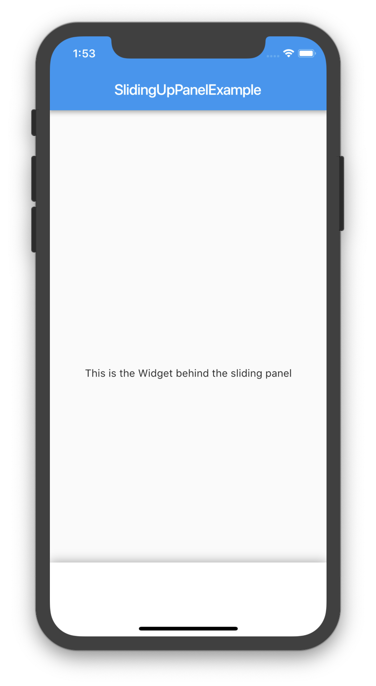
  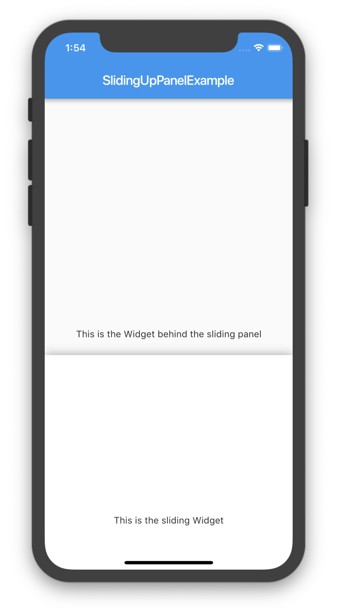
  
</p>


## Custom Usage
There are several options that allow for more control:

| Properties| Description |
|-----------|-------------|
| `childPanel` | (required) The Widget displayed when the sliding panel is fully opened. This slides into view as the panel is opened. When the panel is collapsed and if `childCollapsed` is null, then top portion of this Widget will be displayed on the panel; otherwise, `childCollapsed` will be displayed overtop of this Widget. |
| `childCollapsed` | The Widget displayed in the sliding panel when collapsed. This fades out as the panel is opened. |
| `childBehind` | The Widget that lies underneath the sliding panel. This widget automatically sizes itself to fill the screen. |
| `minHeight` | The height of the sliding panel when fully collapsed. |
| `maxHeight` | The height of the sliding panel when fully open. |
| `border` | A border to draw around the sliding panel sheet. |
| `borderRadius` | If non-null, the corners of the sliding panel sheet are rounded by this BorderRadius. |
| `boxShadow` | A list of shadows cast behind the sliding panel. |
| `color` | The color to fill the background of the sliding panel. |
| `padding` | The amount to inset the children of the sliding panel. |
| `margin` | Empty space surrounding the sliding panel. |
| `renderPanel` | Set to false to not to render the sliding panel. This means that only childBehind, childCollapsed, and the childPanel Widgets will be rendered. Set this to false if you want to achieve a floating effect or want more customization over how the sliding panel looks like. |
| `controller` | If non-null, this can be used to control the state of the panel. |

#### Displaying a Different Child When the Panel is Closed
By assigning a non-null Widget to the `childCollapsed` property, you can add a Widget that displays when the panel is collapsed. As the panel is open, this Widget will fade out to display the `childPanel` underneath. For example:

```
@override
Widget build(BuildContext context) {
  return Scaffold(
    appBar: AppBar(
      title: Text("SlidingUpPanelExample"),
    ),
    body: SlidingUpPanel(
      childPanel: Center(
        child: Text("This is the sliding Widget"),
      ),
      childCollapsed: Container(
        color: Colors.blueGrey,
        child: Center(
          child: Text(
            "This is the collapsed Widget",
            style: TextStyle(color: Colors.white),
          ),
        ),
      ),
      childBehind: Center(
        child: Text("This is the Widget behind the sliding panel"),
      ),
    ),
  );
}
```

<p float="left">
  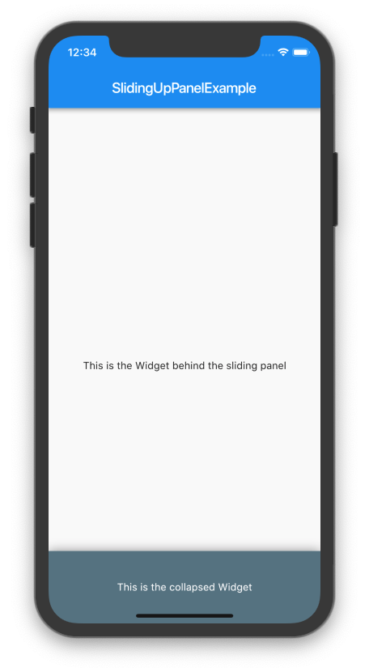
  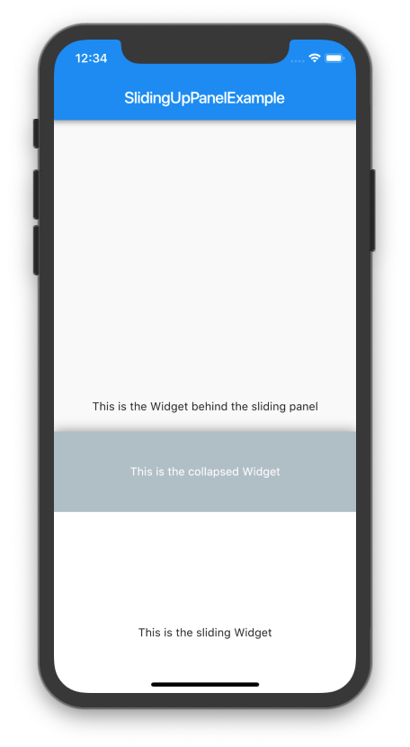
  
</p>


#### Rounding the Borders
Modern design principles (especially in the Material Design Refresh) emphasize rounded borders. A similar effect can be easily achieved by providing a non-null `BorderRadiusGeometry` to the `borderRadius` property. Note that this only curves the border on the underlying panel itself: any children passed to `childPanel` or `childCollapsed` must also have their borders curved separately in order to achieve a uniform effect. For example:


```
@override
Widget build(BuildContext context) {
  BorderRadiusGeometry radius = BorderRadius.only(
    topLeft: Radius.circular(24.0),
    topRight: Radius.circular(24.0),
  );

  return Scaffold(
    appBar: AppBar(
      title: Text("SlidingUpPanelExample"),
    ),
    body: SlidingUpPanel(
      childPanel: Center(
        child: Text("This is the sliding Widget"),
      ),

      childCollapsed: Container(
        decoration: BoxDecoration(
          color: Colors.blueGrey,
          borderRadius: radius
        ),
        child: Center(
          child: Text(
            "This is the collapsed Widget",
            style: TextStyle(color: Colors.white),
          ),
        ),
      ),

      childBehind: Center(
        child: Text("This is the Widget behind the sliding panel"),
      ),

      borderRadius: radius,
    ),
  );
}
```

<p float="left">
  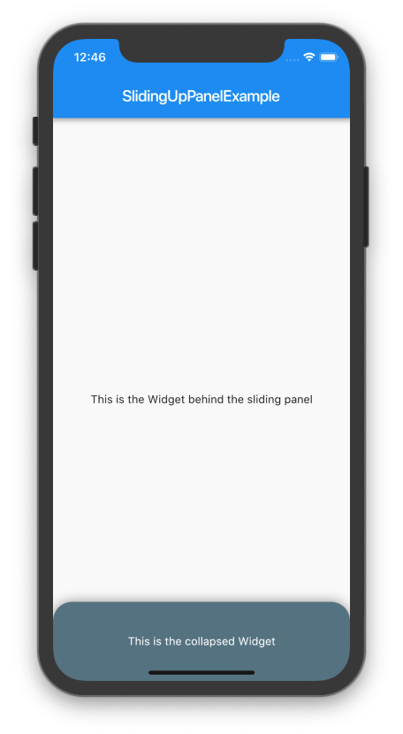
  
  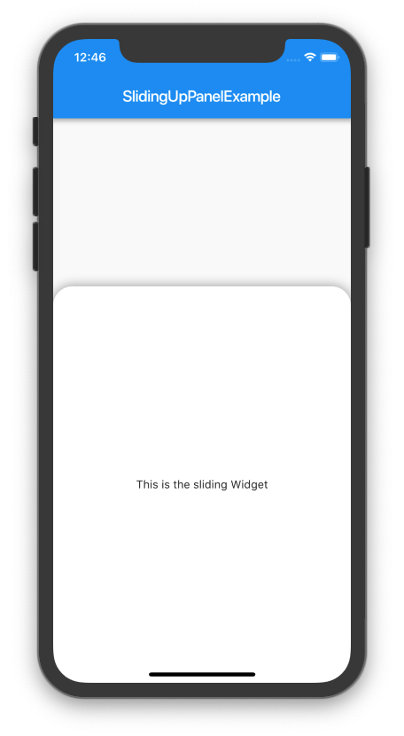
</p>


#### Creating A Floating Effect
To create a fully custom effect, the default panel can be completely hidden and only the children rendered. To do this, set the `renderPanel` property to `false`. For example, to create a floating effect:

```
@override
Widget build(BuildContext context) {
  return Scaffold(
    appBar: AppBar(
      title: Text("SlidingUpPanelExample"),
    ),
    body: SlidingUpPanel(
      renderPanel: false,
      childPanel: _floatingFront(),
      childCollapsed: _floatingCollapsed(),
      childBehind: Center(
        child: Text("This is the Widget behind the sliding panel"),
      ),
    ),
  );
}

Widget _floatingCollapsed(){
  return Container(
    decoration: BoxDecoration(
      color: Colors.blueGrey,
      borderRadius: BorderRadius.only(topLeft: Radius.circular(24.0), topRight: Radius.circular(24.0)),
    ),
    margin: const EdgeInsets.fromLTRB(24.0, 24.0, 24.0, 0.0),
    child: Center(
      child: Text(
        "This is the collapsed Widget",
        style: TextStyle(color: Colors.white),
      ),
    ),
  );
}

Widget _floatingFront(){
  return Container(
    decoration: BoxDecoration(
      color: Colors.white,
      borderRadius: BorderRadius.all(Radius.circular(24.0)),
      boxShadow: [
        BoxShadow(
          blurRadius: 20.0,
          color: Colors.grey,
        ),
      ]
    ),
    margin: const EdgeInsets.all(24.0),
    child: Center(
      child: Text("This is the SlidingUpPanel when open"),
    ),
  );
}
```

Note that a similar effect can be created by simply adding a `margin` to the `SlidingUpPanel`.

<p float="left">
  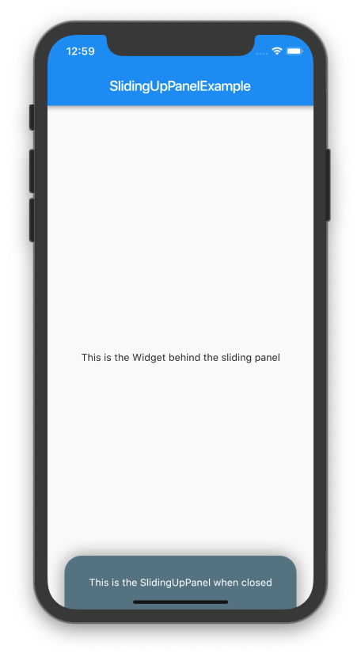
  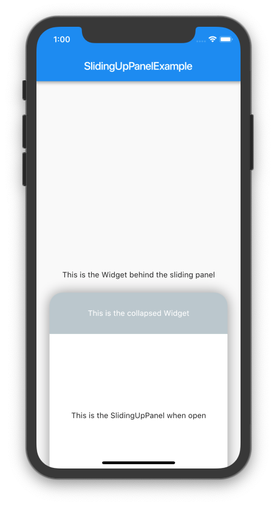
  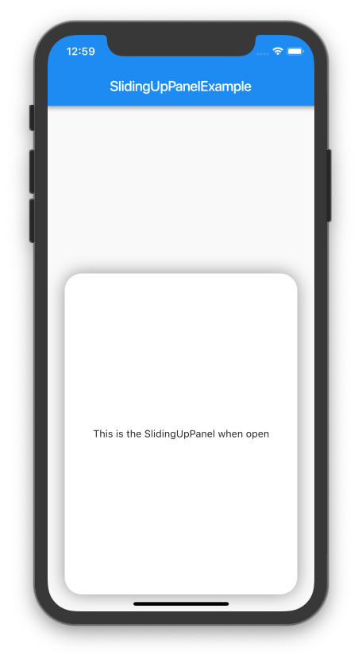
</p>


#### Using the `PanelController`
At times, it can be useful to manually change the state of the `SlidingUpPanel`. This can be easily achieved by using a `PanelController` and attaching it to an instance of the `SlidingUpPanel`.

 Methods| Description |
|-----------|-------------|
|`open()`| Opens the sliding panel fully (i.e. to the  `maxHeight`) |
|`close()`| Closes the sliding panel to its collapsed state (i.e. to the  `minHeight`) |
|`hide()`| Hides the sliding panel (i.e. is invisible) |
|`show()`| Shows the sliding panel in its collapsed state (i.e. "un-hide" the sliding panel) |

```
PanelController _pc = new PanelController();

@override
Widget build(BuildContext context) {
  return Scaffold(
    appBar: AppBar(
      title: Text("SlidingUpPanelExample"),
    ),
    body: SlidingUpPanel(
      controller: _pc,
      childPanel: Center(
        child: Text("This is the sliding Widget"),
      ),
      childBehind: _body(),
    ),
  );
}

Widget _body(){
  return Container(
    child: Column(
      children: <Widget>[
        RaisedButton(
          child: Text("Open"),
          onPressed: () => _pc.open(),
        ),
        RaisedButton(
          child: Text("Close"),
          onPressed: () => _pc.close(),
        ),
        RaisedButton(
          child: Text("Show"),
          onPressed: () => _pc.show(),
        ),
        RaisedButton(
          child: Text("Hide"),
          onPressed: () => _pc.hide(),
        ),
      ],
    ),
  );
}
```

#### Adding Scrollable Elements to the Sliding Panel
The panel itself can contain Scrollable elements. However, it's important to note that when other Scrollable Widgets are nested inside of the panel, you need to incorporate some empty space (i.e. non-scrolling space) at the top which the user can swipe down on to close the panel. For example:

```
@override
Widget build(BuildContext context) {
  return Scaffold(
    appBar: AppBar(
      title: Text("SlidingUpPanelExample"),
    ),
    body: SlidingUpPanel(
      color: Colors.blueGrey,
      childPanel: _scrollingList(),
      childBehind: Center(
        child: Text("This is the Widget behind the sliding panel"),
      ),
    ),
  );
}

Widget _scrollingList(){
  return Container(
    //adding a margin to the top leaves an area where the user can swipe
    //to open/close the sliding panel
    margin: const EdgeInsets.only(top: 36.0),

    color: Colors.white,
    child: ListView.builder(
      itemCount: 50,
      itemBuilder: (BuildContext context, int i){
        return Container(
          padding: const EdgeInsets.all(12.0),
          child: Text("$i"),
        );
      },
    ),
  );
}
```

<p float="left">
  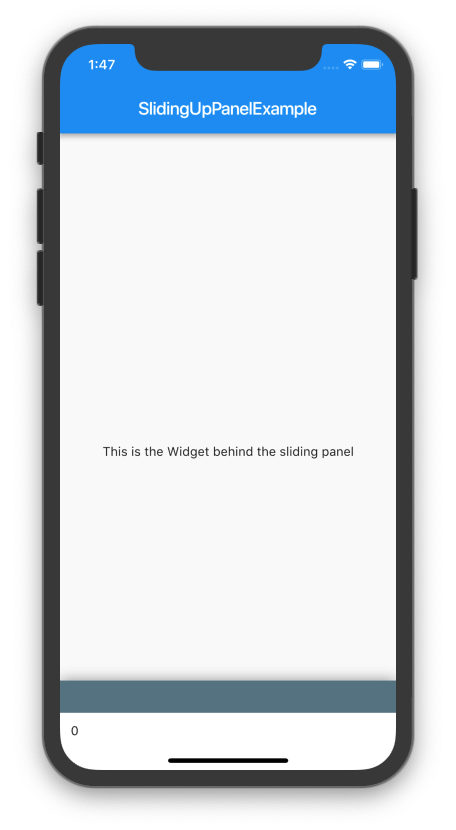
  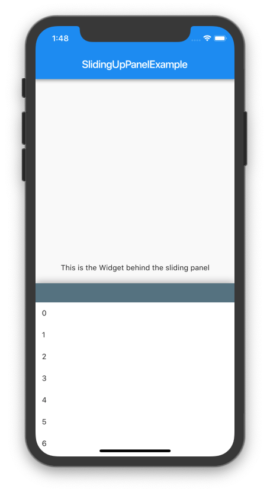
  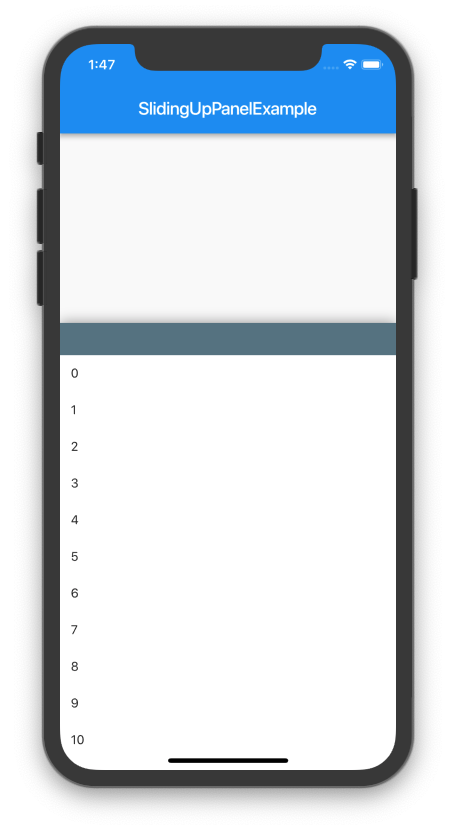
</p>